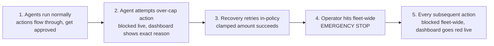

# CodeStreet 2026 — Round 1 Proposal
## Governance Layer for Financial Agents

---

## 1. Problem statement selected

**Theme:** Governance Layer for Financial Agents, one of 7 AmEx CodeStreet 2026 themes (cards & payments).

> A control plane that sits in front of a fleet of financial AI agents (dispute resolution, benefit activation, servicing) and enforces per-agent permissions and spend caps in real time, keeps a full audit trail of every decision, and can revoke a single agent or halt the entire fleet instantly.

**Positioning:** This isn't a 7th agent competing with the other themes, it's the safety layer the other six themes would need before AmEx could actually deploy any of them. A real 2026 incident frames the stakes: an autonomous airline booking agent misrouted over a thousand passengers because nothing checked its actions before it executed them. This project is that missing check, applied to card and payments agents instead of travel agents.

---

## 2. Proposed solution

We built a control plane that every action from a fleet of financial AI agents must pass through before it executes. Three mock agents (dispute, benefit, servicing) emit realistic actions: issuing refunds, activating benefits, filing claims, raising credit limits, reversing fees, reissuing cards. Each action carries an agent ID, action type, dollar amount, and target account. Before any action executes, it is checked against a per-agent policy: which action types the agent may take (scope), how much it may spend (cap), and whether the agent or the whole fleet has been revoked. On a block, the gateway returns the exact rule that fired, not a generic denial, and the decision is logged to an append-only audit trail with a timestamp and measured latency.

Blocks are not dead ends. A Reflexion-style recovery loop intercepts every block: it logs the block, then retries once with an amount clamped inside the agent's cap if the violation was spend-related, and otherwise escalates the action to a human review queue (wrong scope, revoked agent, fleet halt). This mirrors how a real operations team would want the system to behave: attempt a safe, in-policy retry automatically, and only surface a human-in-the-loop escalation when the agent's intent can't be safely auto-corrected.

The operator-facing layer is a live React dashboard fed over a WebSocket: a real-time decision feed, per-agent spend meters against their caps, inline block reasons, a per-agent revoke button, a fleet-wide EMERGENCY STOP, and a policy configuration form that lets an operator edit a spend cap or toggle a permission scope live, no redeploy required. This closes the loop between monitoring and governance: the dashboard doesn't just watch the fleet, it configures the policy the fleet is governed by, directly satisfying AmEx's Round 1 requirement that the solution both monitor and configure policy.

---

## 3. Expected business/societal impact

- **Prevents a misrouted-agent incident before it reaches a customer.** Every agent action is checked against explicit policy before it executes, not audited after the fact.
- **Full accountability.** Every decision, allow or block, is captured in an append-only audit log with the specific rule that fired and the latency of the check, giving compliance and risk teams a complete, tamper-evident record.
- **Operational control without redeploys.** An operator can revoke a single misbehaving agent, adjust a spend cap, toggle a scope, or halt the entire fleet instantly from the dashboard, without touching code or waiting on a release cycle.
- **Faster, safer agent adoption.** By decoupling governance from any individual agent's logic, this control plane becomes reusable infrastructure the other six CodeStreet themes (and any future AmEx agent) can sit behind, lowering the barrier to deploying more agents safely.
- **Societal trust.** Financial institutions deploying autonomous agents face real reputational and regulatory risk from ungoverned actions (the airline misrouting incident is the cautionary example). A visible, auditable governance layer is a concrete trust signal to regulators and customers alike.

---

## 4. Success metrics

| Metric | Result |
|---|---|
| **Policy enforcement accuracy** | 100% on the seeded scripted set — every deliberately-violating action (over-cap, wrong scope, revoked agent) was correctly blocked in all 24 backend tests and the live `/seed` smoke run. |
| **Time-to-detect a violation** | Effectively instant — the policy check is synchronous and in-memory; there is no detection lag, a block is known at the moment the action is submitted. |
| **Latency overhead per agent action** | ~0.002 ms per gateway decision, measured live. |

The latency figure comes from a live smoke test: `POST /seed` was run against the running FastAPI server, and the resulting decisions were inspected via the audit log. `latency_ms` is captured with `time.perf_counter()` immediately before and after every `PolicyGateway.check()` call and stamped onto that decision's row in the SQLite audit log, so the number reflects the actual, per-decision cost of the policy check in the running system, not an estimate. At ~0.002 ms per check, the gateway sits three orders of magnitude under the sub-5ms target set for this theme, meaning the governance layer imposes no perceptible overhead on agent throughput even at fleet scale.

---

## 5. Implementation approach

Built bottom-up as a vertical slice, backend-first:

1. **Policy gateway** — a plain dict of per-agent policies (`allowed_actions`, `spend_cap`, `revoked`) plus a fleet-wide `halted` flag and a `check()` function, deliberately not an OPA/rules-DSL, per the brief's explicit constraint to keep setup cost low.
2. **Audit log** — raw `sqlite3`, one append-only `audit_log` table (plus an `escalations` table for the recovery loop), no ORM.
3. **Mock agents** — three scripted agents (dispute, benefit, servicing) emitting a realistic mix of in-policy and deliberately-violating actions, so the demo produces real blocks, not just green checkmarks.
4. **Recovery loop** — a small, purpose-built Reflexion-style loop: block → log → retry-once-in-policy (for over-cap only) → else escalate to a human queue. No external Reflexion library was reused; none was found locally, and this is documented as a fresh implementation.
5. **API** — FastAPI exposing REST endpoints for actions, policy read/patch, revoke, fleet halt/resume, and audit read, plus a WebSocket that broadcasts every decision live.
6. **Dashboard** — a React + Vite frontend consuming the WebSocket feed and REST API, giving the operator both visibility (live feed, spend meters, inline block reasons) and control (revoke, policy config form, EMERGENCY STOP).

Each backend module was built test-first; the full backend is covered by 24 passing pytest tests before any frontend work began, so the governance logic was verified independent of UI concerns.

---

## 6. Technical details

### Stack

- **Backend:** FastAPI + raw `sqlite3` (Python stdlib), no ORM.
- **Frontend:** React + Vite, WebSocket-fed live dashboard.
- **Explicitly not used, by design:** OPA / rules DSL, Postgres, Redis. The brief calls for a boring, fast stack sized to the hackathon time budget; a dict-of-policies engine and a single SQLite file are sufficient for the demo's scope and keep the whole system auditable in a few hundred lines.

### Architecture diagram

Three mock agents (dispute, benefit, servicing) submit actions to the Policy Gateway. Allowed actions execute (mocked) and are logged; blocked actions are routed to the Recovery loop, which retries once in-policy or escalates, and its outcome is logged too. Every decision lands in the SQLite audit log, which feeds a FastAPI REST + WebSocket layer. The React dashboard consumes that feed for live monitoring and writes back to the API to revoke agents, edit spend caps/scopes, or trigger the fleet-wide emergency stop.

### Demo sequence flowchart

### Assumptions / constraints

- **All data is mocked and synthetic.** Agent identities, transaction amounts, target accounts, and policy values are all fabricated for this prototype. Nothing in this system connects to, reads from, or writes to any real AmEx system, account, or customer data, and no part of the demo should be read as representing real AmEx infrastructure or data.
- Hackathon time budget: prioritized a working, fully-tested vertical slice (backend logic + tests) over broad but shallow feature coverage; frontend polish and the deck/video deliverables were sequenced after the backend was solid.
- No authentication/login on the dashboard — acceptable for a hackathon prototype with mocked data only, not acceptable as-is for production.

### Scalability notes

- **SQLite → Postgres:** the audit log module (`src/backend/audit.py`) is a thin wrapper around plain SQL with no ORM-specific coupling; swapping the `sqlite3` connection for a Postgres client (e.g. `psycopg`) is a contained change to one module, not a rewrite of the policy or recovery logic.
- **Dict-policy engine → real rules service:** `PolicyGateway.check()` currently evaluates a dict of policies in-process. As the fleet grows past a handful of agents and policies gain more nuance (time-of-day limits, cross-agent aggregate caps, risk scoring per action type), the same `check(action) -> Decision` interface can be backed by a dedicated rules/policy microservice (or OPA at that point, once the added operational cost is justified by scale) without changing any caller — `main.py`, `recovery.py`, and the dashboard all depend only on the `Decision` shape, not the evaluation mechanism.
- The WebSocket broadcast layer is a single in-process `ConnectionManager`; at fleet scale this is the natural place to introduce a pub/sub layer (e.g. Redis Streams) between the audit writer and dashboard clients, without touching the gateway or recovery logic.
