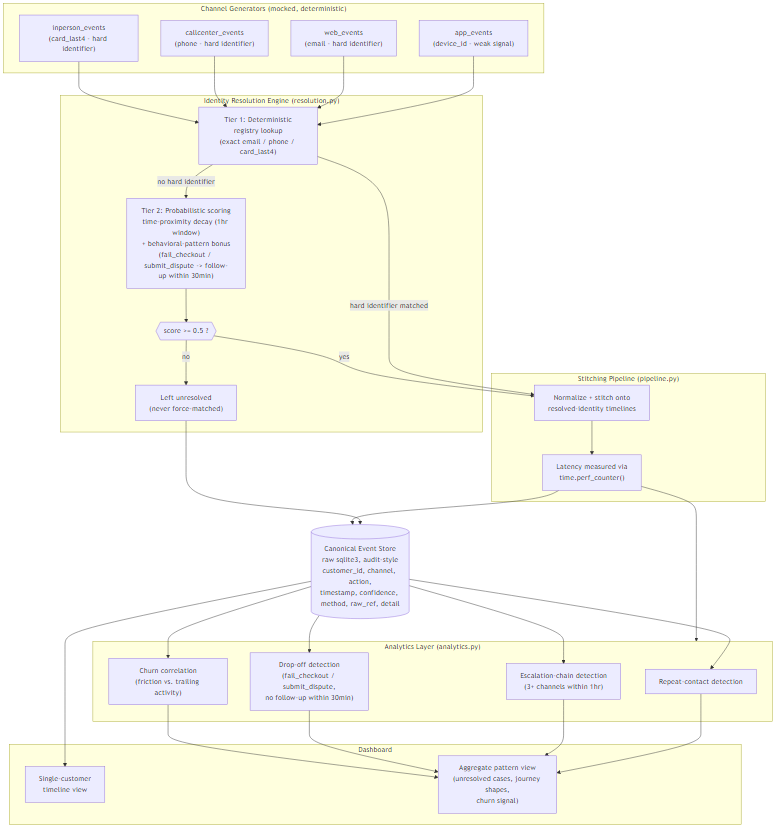
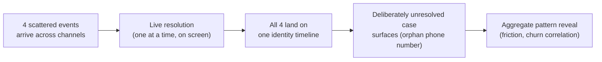

# Throughline

**AmEx CodeStreet 2026 — Round 1 Proposal**
**Theme: Cross-Channel Journey Stitching**

---

## 1. Problem Statement Selected

The selected theme is **Cross-Channel Journey Stitching**.

AmEx customers move fluidly across app, web, call-center, and in-person channels, but the systems recording those interactions do not. A dispute that starts with a failed checkout on the app, continues on the web, escalates through a call-center agent, and resolves at a branch counter looks, today, like four unrelated events in four unrelated systems. No one system — and no person looking at any single system — can see it as **one journey**. Journey breakdowns (a customer who tries to resolve something and simply gives up), and cases where a customer's identity can't be confidently tied together across channels at all, are effectively invisible. Without a unified, cross-channel view, AmEx cannot reliably detect where journeys break down, cannot distinguish a resolved case from a silently abandoned one, and cannot see the patterns — repeat contact, escalation, drop-off — that correlate with customer churn until it has already happened.

## 2. Proposed Solution

**Throughline** links a customer's fragmented interactions — app, web, call-center, in-person — into a single chronological timeline via a two-tier identity resolution engine. Tier 1 is deterministic: an exact match on a hard identifier the customer already has on file with AmEx (email, phone, or card last-4). Tier 2 is probabilistic, used only when no hard identifier is present: it scores candidate links using time-proximity decay over a bounded window plus a behavioral-pattern bonus (a failed checkout or a submitted dispute followed by a recognized follow-up action shortly after, on a different channel). Events that don't clear a defined confidence threshold are left explicitly **unresolved** — never force-matched onto a plausible-looking identity — because a wrong match is worse than an honest gap in a financial services context.

That honesty is the second half of the solution: Throughline surfaces journey breakdowns and unresolved cases as first-class outputs, not edge cases to hide in a footnote. A customer whose failed web checkout gets no follow-up on any channel within 30 minutes is flagged as a drop-off. A customer who is bounced across three or more channels within an hour is flagged as an escalation chain. These aren't asserted from seeded test data — they're computed live from the resolved timeline itself, which is what makes them trustworthy outputs rather than demo dressing.

Third, Throughline aggregates these per-customer signals into cross-customer patterns correlated with churn: repeat-contact rate, escalation rate, ranked drop-off points, and a friction-vs-return-activity correlation that shows customers with compounding journey friction come back measurably less often than customers with clean journeys. Critically, Throughline is positioned not as a seventh competing CodeStreet agent alongside a dispute-resolution agent, a benefit-activation flow, or a servicing-call assistant — it is the **visibility layer those agents' data flows through**. Every one of the other six CodeStreet themes generates cross-channel customer interaction data, and none of them is independently traceable end-to-end without a stitching layer underneath it. Throughline is the substrate, not a rival.

## 3. Expected Business/Societal Impact

- **Reduced silent churn.** Journey breakdowns that currently go undetected — a customer who tries once, fails, and never comes back — become a visible, ranked, actionable signal instead of a number that only shows up months later as an attrition statistic.
- **Faster, better-informed service.** A call-center agent or claims reviewer picking up a case mid-journey sees the full cross-channel history instantly, instead of asking the customer to re-explain what already happened on the app or web.
- **Trustworthy automation substrate for the rest of CodeStreet.** Any theme that generates customer-facing events (dispute agents, benefit-activation flows, servicing calls) can plug into Throughline's resolved timeline instead of re-solving identity resolution themselves, reducing duplicated effort and inconsistent identity logic across the portfolio.
- **Honest handling of ambiguity builds trust, not risk.** By refusing to force-match weak signals, Throughline avoids the reputational and compliance risk of misattributing one customer's activity to another — a real risk in a system with shared devices, anonymous sessions, and household card usage.
- **Societal angle:** customers who abandon a dispute or servicing attempt after a bad cross-channel experience are disproportionately the ones who most need it resolved (fraud disputes, failed transactions). Surfacing drop-offs surfaces exactly the customers most at risk of being underserved.

## 4. Success Metrics

All figures below are measured against a live server instance (real SQLite file, not in-memory) using `time.perf_counter()`, consistent with the measurement methodology used on a prior sibling project.

**Resolution accuracy and latency**
- `resolution_accuracy_pct`: **100.0%** — 28 seeded events, all correctly resolved to the right customer, or correctly left unresolved, against known ground truth.
- `pipeline_latency_ms`: **175.97ms** total for 28 events, real SQLite file writes.
- `avg_latency_per_event_ms`: **6.28ms** per event, ingestion through placement on the resolved timeline.

**Handling of deliberately ambiguous cases** (this is where the 100% accuracy figure is actually tested, not just asserted):
- A **shared-device pair** — two different customers logging in from the same `device_id`, hours apart, with no hard identifier and no behavioral trigger on the ambiguous events — was correctly left **unresolved** rather than force-matched to either customer.
- A **true orphan phone number**, matching no known customer record in the registry, was correctly flagged **unresolved** rather than attached to the nearest plausible customer.

**Aggregate pattern findings** (13 resolvable customers; 1 additional true orphan excluded from journey-pattern analysis — a single unresolved event isn't enough journey to characterize):
- `repeat_contact_rate_pct`: **30.77%**
- `escalation_rate_pct`: **15.38%**
- **3 distinct ranked drop-off points** identified — e.g., a customer whose failed web checkout received zero follow-up on any channel.
- **8 distinct journey shapes** observed, ranked by frequency (most common: single-channel "web only," 4 customers).
- **Churn correlation:** customers with 2+ computed friction events (n=2) showed trailing activity at **1.0 events/customer**, versus **5.0 events/customer** for clean-journey customers (n=7) — a **5x lower return rate** (`high_friction_rate_vs_clean` = 0.2).

## 5. Implementation Approach

1. **Mock channel generation** — four independent generators (`app_events`, `web_events`, `callcenter_events`, `inperson_events`) produce deterministic, timestamp-anchored synthetic events, plus a known-customer registry limited to identifiers AmEx would realistically already hold (email, phone, card last-4). Device and cookie IDs are deliberately excluded from the registry — they're weak, sometimes-shared pseudonymous signals, never treated as proof of identity.
2. **Two-tier resolution** — deterministic registry match first; probabilistic time+behavior scoring second, only for events with no hard identifier; a fixed threshold below which an event is honestly left unresolved.
3. **Stitching pipeline** — normalizes each channel's raw event shape into one canonical record and writes it onto the resolved customer's timeline, with pipeline latency measured end-to-end.
4. **Dual consumption** — every resolved (and unresolved) event lands in an audit-style SQLite store *and* feeds the analytics layer in the same pass, so the two never drift out of sync.
5. **Analytics computed from the resolved timeline itself** — repeat-contact, escalation-chain, and drop-off detection run against what the resolution engine actually produced, not against seeded ground truth, so the churn correlation is a genuine derived finding.
6. **Live demo sequence** — a WebSocket-driven `/demo/run` endpoint replays: four scattered events arriving from different channels → resolving live onto one identity → a deliberately unresolved case appearing → an aggregate pattern reveal. This is built for a judge-facing walkthrough, not just an API contract.
7. **Testing** — 33 passing pytest tests covering generators, resolution (including both ambiguous cases above), the pipeline, and analytics.

## 6. Technical Details

**Stack:** FastAPI + raw `sqlite3` (no ORM, no OPA, no Postgres, no Redis) on the backend; React + Vite on the frontend. This is a deliberate choice, not a shortcut — a two-tier resolution engine and an append-only audit event store are the kind of financial-services-adjacent logic that benefits from being boring and directly inspectable rather than hidden behind an ORM abstraction or a policy engine judges can't easily read line by line.

**Architecture:**

The four channel generators feed the identity resolution engine (deterministic registry match, then probabilistic scoring for anything without a hard identifier). Resolved events flow into the stitching pipeline, which writes onto both the audit-style SQLite event store and the analytics layer in the same pass. Both the store and the analytics layer feed the dashboard: a single-customer timeline view, and an aggregate pattern view.

**Phase 6 demo sequence:**

**Assumptions and constraints:**
- All data used in this prototype is **mocked and synthetic**, generated by deterministic, timestamp-anchored code. This never implies real AmEx systems, real AmEx infrastructure, or real customer data of any kind.
- The known-customer registry, the ambiguous shared-device pair, and the orphan phone number are all intentionally constructed test cases, designed to stress the resolution engine's honesty under ambiguity — not drawn from or representative of any real population.
- Thresholds (1-hour time-proximity window, 30-minute behavioral-pattern window, 0.5 confidence threshold) are explainable, rule-based constants chosen for a defensible pitch narrative, not tuned against real-world data.

**Scalability — the production migration path:**

This prototype is intentionally built on a boring, auditable stack so the logic — not the infrastructure — is what's being evaluated. The production migration path is explicit, not hand-waved:

- **Ingestion:** the in-process mock event generators become real streaming ingestion at scale — **Kafka or Spark Streaming** — consuming actual app, web, call-center, and in-person event feeds instead of synthetic ones.
- **Event store:** the raw SQLite file becomes a warehouse-grade store — **Snowflake or BigQuery** — for the canonical, audit-style event log, preserving the same schema (customer_id, channel, action, timestamp, confidence, method, raw_ref, detail) at production scale and retention.
- **Analytics layer:** the output shape of the analytics layer (repeat-contact, escalation, drop-off, churn correlation) is deliberately designed to **feed a downstream product analytics tool like Amplitude or Mixpanel**, not to replace one. Throughline's job is to solve cross-channel identity resolution and produce a trustworthy, resolved event stream — not to reinvent a product analytics platform.

This is the deliberate migration path from a boring, auditable prototype stack to production infrastructure — not a system that's half-built now and hoping to grow into these pieces later.

---

*All data in this proposal and the accompanying prototype is mocked and synthetic. Nothing in this document or the underlying code implies real AmEx systems, infrastructure, or customer data.*
